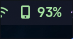

🇸🇦 اقرأ بالعربية | [🇬🇧 Read in English](README.md)

# 📱 مؤشر شحن الهاتف لـ Waybar

سكربت أنيق وخفيف لعرض حالة بطارية هاتفك المحمول مباشرة في [Waybar](https://github.com/Alexays/Waybar) باستخدام **KDE Connect**.



---

## ✨ الميزات

* **اكتشاف تلقائي:** يكتشف مُعرّف (ID) هاتفك المتصل تلقائياً (لا حاجة لأي إعدادات يدوية!).
* **ألوان ديناميكية:** يتغير لون الموديول بناءً على مستوى البطارية (طبيعي، تحذير، حرج).
* **مؤشر الشحن:** يعرض أيقونة صاعقة (``) عندما يكون الجهاز متصلاً بالشاحن.
* **إشعارات ذكية:** احصل على تنبيهات فورية عند انخفاض البطارية، أو عند توصيل وفصل الشاحن.
* **اتصال سريع (Ping):** انقر بزر الماوس الأيسر على الموديول في Waybar لجعل هاتفك المفقود يرن.
* **مزامنة الحافظة:** انقر بزر الماوس الأيمن على الموديول لإرسال النص المنسوخ (Clipboard) في حاسوبك إلى هاتفك مباشرة.

---

## 📦 المتطلبات الأساسية

قبل التثبيت، تأكد من وجود البرامج التالية على نظامك:
* `kdeconnect` (مقترن ومتصل بهاتفك المحمول)
* `waybar`
* `wl-clipboard` (مطلوب لإرسال النصوص من الحافظة إلى هاتفك)
* `libnotify` (مطلوب لعمل إشعارات النظام)
* خط من نوع Nerd Font لعرض الأيقونات بشكل صحيح (مثل: *JetBrains Mono Nerd Font*).

---

## 🚀 التثبيت

اتبع هذه الخطوات البسيطة لتثبيت السكربت:

1. افتح مجلد المستودع:  
```bash
cd mobile_charge_indicator_waybar
```

2. أعطِ صلاحيات التشغيل لملف التثبيت:

```bash
chmod +x install.sh  
```

3. قم بتشغيل سكربت التثبيت:

```bash
./install.sh
```

*(هذا السكربت سيقوم تلقائياً بنسخ `mobile.sh` إلى مسار `~/.config/waybar/scripts/` وإعطائه صلاحيات التشغيل).*

---

## ⚙️ إعدادات Waybar

1. افتح ملف إعدادات Waybar (عادةً يكون في `~/.config/waybar/config` أو `config.jsonc`).
2. أضف `"custom/mobile"` إلى المصفوفة `modules-right` أو `modules-center` أو `modules-left`.
3. أضف الكود التالي الخاص بالموديول:

```json
"custom/mobile": {
    "format": "{text}",
    "exec": "~/.config/waybar/scripts/mobile.sh",
    "interval": 30,
    "return-type": "json",
    "on-click": "~/.config/waybar/scripts/mobile.sh --ping",
    "on-click-right": "~/.config/waybar/scripts/mobile.sh --clipboard"
}
```

---

## 🎨 تنسيق Waybar (Style)

افتح ملف تنسيق Waybar (عادةً `~/.config/waybar/style.css`) وأضف الكود التالي لتخصيص المظهر:

```css
/* موديول بطارية الهاتف */
#custom-mobile {
    font-family: "JetBrains Mono Nerd", monospace;
    font-size: 14px;
    padding: 0 6px;
    margin-left: 4px;
}

/* الألوان بناءً على حالة البطارية */
#custom-mobile.critical {
    color: #f07178; /* أحمر للبطارية المنخفضة */
}
#custom-mobile.warning {
    color: #f2cd66; /* أصفر للبطارية المتوسطة */
}
#custom-mobile.normal {
    color: #c3e88d; /* أخضر للبطارية الجيدة */
}
```

---

## 💡 طريقة الاستخدام

* بمجرد التثبيت وإضافة الإعدادات، قم بإعادة تشغيل Waybar. ستظهر لك حالة بطارية الهاتف الآن.
* **انقر بزر الماوس الأيسر** على الموديول في الشريط في أي وقت لجعل هاتفك يرن (Ping).
* **انقر بزر الماوس الأيمن** على الموديول لإرسال النص الموجود في الحافظة (Clipboard) مباشرة إلى هاتفك.

---

## 📝 ملاحظات

* تأكد من أن خدمة (daemon) KDE Connect تعمل في الخلفية وأن جهازك مقترن بشكل صحيح.
* تم اختباره ويعمل بشكل ممتاز مع Waybar على توزيعة Arch Linux.

---

## 🤝 الدعم

إذا وجدت هذا السكربت مفيداً في تخصيص واجهتك، فلا تنسَ دعمه بإعطائه نجمة (⭐) على GitHub!
